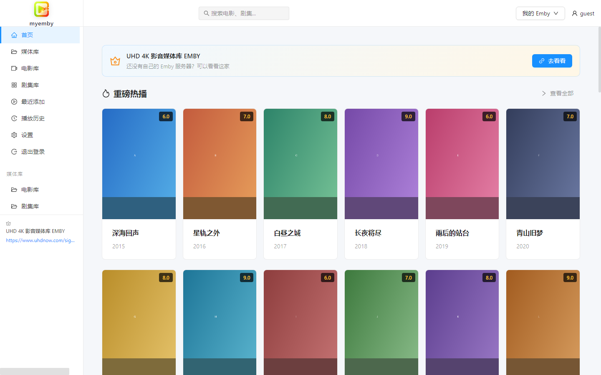
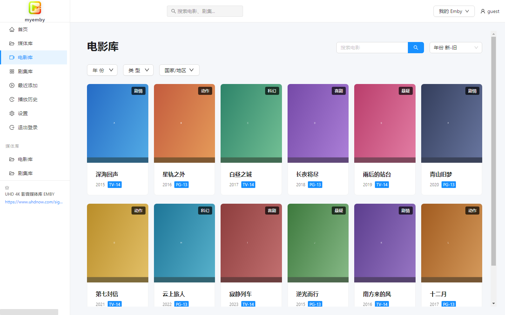
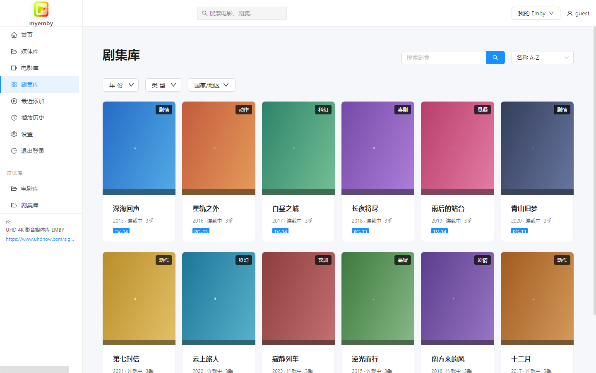
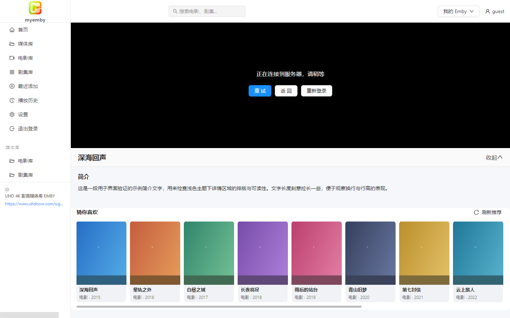
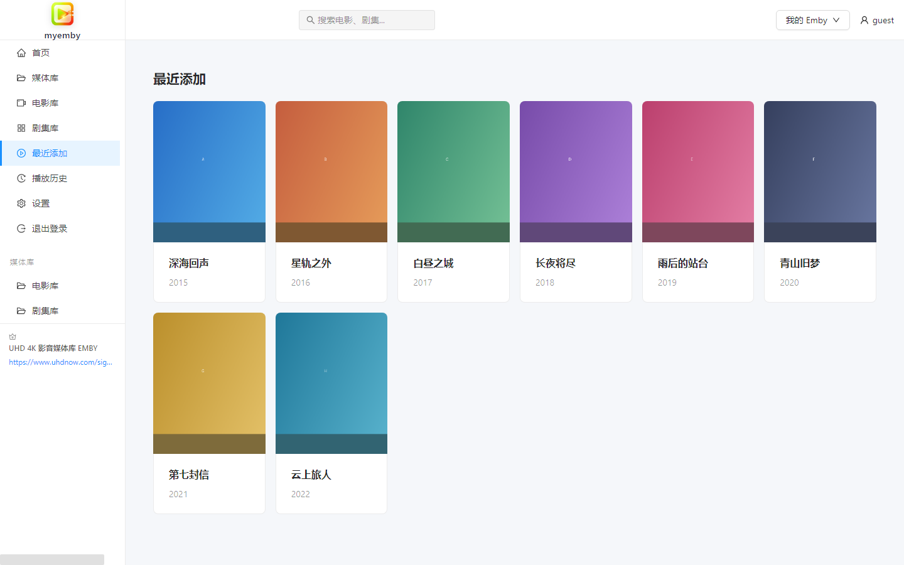
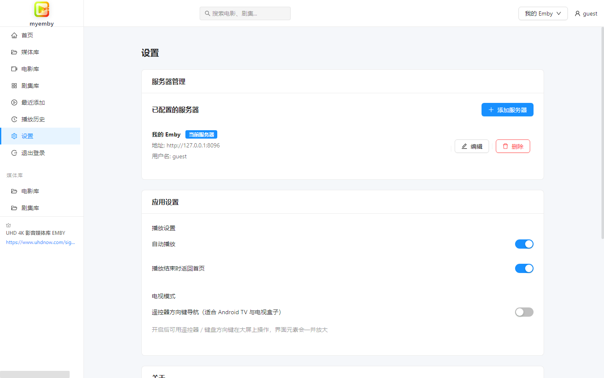

# myemby（我的EMBY）

> 一个轻量、干净的 Emby 客户端 —— **默认浅色主题**，**五个平台同一套体验**。

<p>
  
  
  
  
  
  
</p>

myemby 把网页版的 [Emby](https://emby.media/) 变成一个**独立、顺手、看得清**的客户端：
不用再开浏览器、不用再忍受深色界面。一套代码同时出 **Windows / Linux / Android 手机 /
Android TV / 网页端**，五端界面一致、功能一致、改一处全端生效。

> 🎬 **推荐 Emby 服务**：[UHD 4K 影音媒体库 EMBY](https://www.uhdnow.com/signup?invite=AN913K)
> —— 还没有自己的 Emby 服务器？可以看看这家。

---

## 📸 界面预览

### 首页 —— 重磅热播 / 分类聚合



### 电影库 —— 搜索、年份 / 类型 / 国家筛选与排序



### 剧集库



### 播放页 —— 影片详情、剧集选择、猜你喜欢



### 最近添加



### 设置 —— 服务器管理、电视模式开关



---

## ✨ 功能特点

- **五端同源**：Windows / Linux / Android 手机 / Android TV / 网页端，一套代码。
- **默认浅色主题**：整体浅白配色，长时间看不刺眼；仅视频画面区域保持黑色。
- **直接播放 Emby 内容**：支持 HLS 流媒体，可切换码流与字幕。
- **媒体库浏览**：电影库、剧集库、最近添加、播放历史一应俱全。
- **搜索**：顶部搜索框直接搜影片、剧集、单集。
- **筛选与排序**：按年份、类型、国家/地区筛选，按添加时间 / 名称 / 年份 / 评分排序。
- **剧集连播**：点剧集自动从第一季第一集开始，播放页可切换季与集。
- **多服务器**：保存多个 Emby 服务器随时切换，凭据本地加密存储。
- **电视端遥控器操作**：方向键焦点导航 + 回车确认 + 返回键回退，界面元素自动放大。
- **网页端即开即用**：不用安装，浏览器打开就能连自己的 Emby。

---

## ⬇️ 下载安装

全部产物都在 [**Releases**](https://github.com/xikkcn/myemby/releases) 页面。

### Windows

| 文件 | 说明 |
| --- | --- |
| `myemby-Setup-1.0.0.exe` | **安装版（推荐）**。可自选安装位置，自动创建快捷方式，带卸载程序。 |
| `myemby-Portable-1.0.0.exe` | **免安装版**。双击直接运行，不写注册表，可放 U 盘。 |

要求 Windows 10 / 11 / Windows Server 2016 及以上（64 位）。

### Linux

| 文件 | 说明 |
| --- | --- |
| `myemby-1.0.0-linux-x64.tar.gz` | 绿色包，解压后执行目录里的 `myemby` 即可，绝大多数发行版通用。 |

> AppImage / deb 需要 Linux 环境构建（Windows 无法交叉编译）。仓库自带 GitHub Actions
> 工作流，在 Actions 里手动运行一次即可产出这两种格式。

### Android 手机 / 平板 / Android TV

**同一个 APK 手机和电视都能装** —— 已同时注册手机桌面图标与电视 Leanback 启动器，
电视上会自动进入电视模式（遥控器方向键操作）。

| 文件 | 适用 |
| --- | --- |
| `myemby-v1.0.0-android-arm64-v8a.apk` | 64 位 ARM，近几年绝大多数手机与电视盒子 |
| `myemby-v1.0.0-android-armeabi-v7a.apk` | 32 位 ARM，较老的机型与盒子（**老盒子优先选这个**） |
| `myemby-v1.0.0-android-universal.apk` | 通用包，不确定机型时选它 |
| `myemby-v1.0.0-android-legacy21-arm64-v8a.apk` | **Android 5.0 / 5.1 老设备专用**（minSdk 21） |
| `myemby-v1.0.0-android-legacy21-armeabi-v7a.apk` | 同上，32 位老盒子首选 |
| `myemby-v1.0.0-android-legacy21-universal.apk` | 同上，通用包 |

> **怎么选**：普通手机/平板先试 `arm64-v8a`；老电视盒子（Android 5/6）用
> `legacy21-armeabi-v7a`；实在不确定就用对应的 `universal`。

### 网页端（免安装，浏览器直接用）

在线地址：**https://xikkcn.github.io/myemby/**

打开即用，连你自己的 Emby 服务器即可。缺点是不支持直连一些需要本地解码的特殊编码，
高码率片源建议用桌面端或电视端。

---

## 🚀 使用说明

### 1. 添加服务器

首次打开会停在 **设置 → 服务器管理**，点 **添加服务器**：

| 字段 | 说明 |
| --- | --- |
| 服务器名称 | 随便起，仅用于区分，例如「家里的 Emby」 |
| 服务器地址 | 只填主机名或 IP，**不要带 `http://`**，例如 `192.168.1.10` |
| 协议 | 局域网一般 `http`；用域名 + HTTPS 证书时选 `https` |
| 端口 | Emby 默认 `8096`，HTTPS 默认 `8920`；留空用协议默认端口 |
| 用户名 / 密码 | 你的 Emby 账号，填了下次自动登录 |

点保存后回到首页，右上角 **登录**（填过账号密码会自动登录）。

### 2. 浏览与播放

- 左侧栏切换 **首页 / 媒体库 / 电影库 / 剧集库 / 最近添加 / 播放历史 / 设置**。
- 顶部搜索框输入 2 个字以上会实时出结果，点结果直接播放。
- 点海报开始播放；点剧集从第一季第一集开始。
- 播放页下方是 **影片详情**、**猜你喜欢**；剧集可在详情区切换季与集。
- 播放器右下角可切换码流（清晰度）与字幕。

### 3. 电视端怎么用遥控器

电视端打开后会自动进入**电视模式**，界面元素放大、出现蓝色焦点框：

| 按键 | 作用 |
| --- | --- |
| **方向键 ↑↓←→** | 在按钮、海报、菜单之间移动焦点 |
| **确定 / 回车** | 打开当前选中的项目 |
| **返回键** | 回到上一级页面 |
| **菜单键** | 部分设备可呼出播放器控制条 |

如果自动识别没生效（个别电视盒子无触摸屏判断不准），到 **设置 → 应用设置 → 电视模式**
手动打开开关即可。也可以在网址后加 `?tv=1` 强制开启。

### 4. 网页端在线使用

访问 https://xikkcn.github.io/myemby/ ，添加服务器即可。
因为是浏览器直连你的 Emby，**Emby 服务器必须允许跨域**（Emby 默认已允许）；
若你的服务器在局域网且没有公网地址，外网访问需要自己做好端口映射或内网穿透。

### 5. 数据存在哪

服务器地址、账号与登录令牌保存在本机应用数据目录（`localStorage`），服务器配置做了 AES 加密。
**卸载或清空应用数据即彻底清除**，不会上传到任何地方。

---

## ❓ 常见问题

**Q：打开是白屏 / 一直转圈？**
先确认没有被杀毒软件拦截。若装过旧版本，清空应用数据后重开一次。

**Q：连不上服务器？**

- 地址栏只写主机名/IP，不要带 `http://`，协议由下拉框决定。
- 端口确认：HTTP 默认 `8096`，HTTPS 默认 `8920`。
- 自签名证书的 HTTPS 服务器已做忽略证书校验处理，正常可连。
- 检查设备与 Emby 服务器是否同网、防火墙是否放行。

**Q：能登录、能看列表，但点播放黑屏？**
多数是服务端转码未开启，或该视频编码当前客户端不支持。先在 Emby 网页端试播同一个视频，
若网页端也要转码，请检查服务端转码设置（硬件转码 / FFmpeg 路径）。

**Q：电视上方向键没反应？**
到设置里确认「电视模式」已打开；或改用遥控器的「鼠标模式」确认应用是否获得焦点。

**Q：电视该装哪个 APK？**
不确定就先试 `arm64-v8a`，装不上或是老盒子（Android 5/6）就用 `armeabi-v7a` 或
`legacy21` 版本。

**Q：为什么视频区域是黑的？**
播放器画面用黑底是刻意的（与主流视频网站一致，避免亮边框影响观感），界面其余部分都是浅色。

---

## 🛠️ 从源码构建

需要 Node.js 18+（推荐 20/22）。安卓端另需 JDK 17 与 Android SDK。

```bash
git clone https://github.com/xikkcn/myemby.git
cd myemby

npm install

# 开发模式
npm run dev              # 浏览器调试界面
npm run electron:dev     # 桌面端调试（需先启动 npm run dev）

# 桌面端打包（产物在 dist_electron/）
npm run electron:build:win
npm run electron:build:linux

# 网页端
npm run build            # 产物在 dist/renderer/

# 安卓端（需先配好 Android SDK）
npm run cap:sync
npm run cap:open         # 用 Android Studio 打包，或用 gradle 命令行
```

### 国内网络

仓库自带 `.npmrc`，已把 Electron 与 electron-builder 的下载源指向国内镜像。
如果打包报 `Bad Gateway`，说明 electron-builder 没读到 `.npmrc`，请显式导出：

```bash
export ELECTRON_MIRROR="https://npmmirror.com/mirrors/electron/"
export ELECTRON_BUILDER_BINARIES_MIRROR="https://npmmirror.com/mirrors/electron-builder-binaries/"
```

### 目录结构

```
main.js                 Electron 主进程（Windows / Linux）
preload.js              预加载脚本
index.html              页面入口
vite.config.ts          Vite 配置（输出到 dist/renderer）
capacitor.config.ts     安卓端配置
electron-builder 配置    见 package.json 的 build 字段
buildResources/
  icon.ico              Windows 图标（7 种尺寸）
  icons/                Linux 图标集
  android/              安卓图标（自适应图标）
src/
  main.tsx              React 入口（HashRouter + 电视模式初始化）
  App.tsx               路由与主题配置
  config/promo.ts       应用名 / 推广位等全局常量
  platform/             平台识别与电视端方向键空间导航
  components/           布局、搜索栏、推广位等
  pages/                首页、电影库、剧集库、播放页、最近添加、播放历史、设置
  stores/               Zustand 状态管理（服务器 / 登录 / 媒体库）
  styles/               全局样式（含 tv.scss 电视模式）
docs/images/            README 用界面截图
```

---

## 📦 技术栈

Electron 25 · Capacitor · React 18 · TypeScript 5 · Vite 4 · Ant Design 5 ·
Zustand · Axios · HLS.js · Video.js · Sass

---

## ⚠️ 免责声明

本项目仅供学习与研究使用，请勿用于商业用途。使用本软件产生的任何后果由使用者自行承担。
本项目不提供任何媒体内容，也不对第三方 Emby 服务器及其内容的合法性负责。

---

## 📝 许可证

[MIT](LICENSE) © 2025 xikkcn

本项目包含来自
[CodeCrafter-bit/emby-player](https://github.com/CodeCrafter-bit/emby-player) 的代码，
其原始版权声明已依 MIT 许可证保留于 [LICENSE](LICENSE) 文件中。

---

> 🎬 **UHD 4K 影音媒体库 EMBY** —— [https://www.uhdnow.com/signup?invite=AN913K](https://www.uhdnow.com/signup?invite=AN913K)
