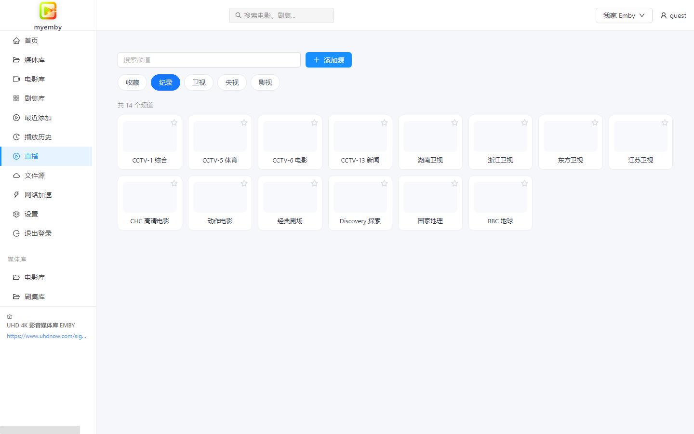
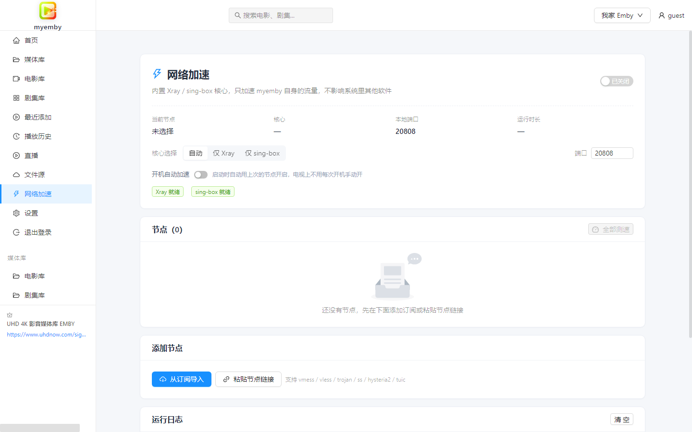
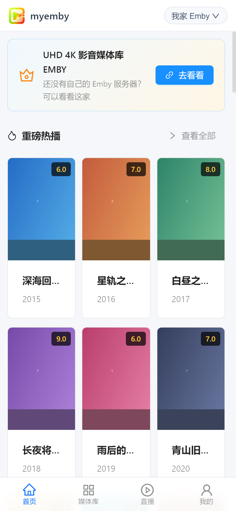
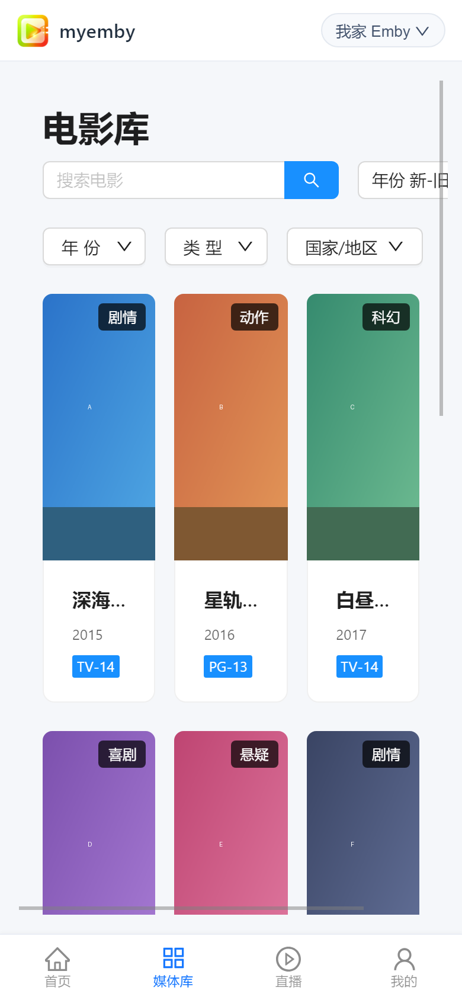
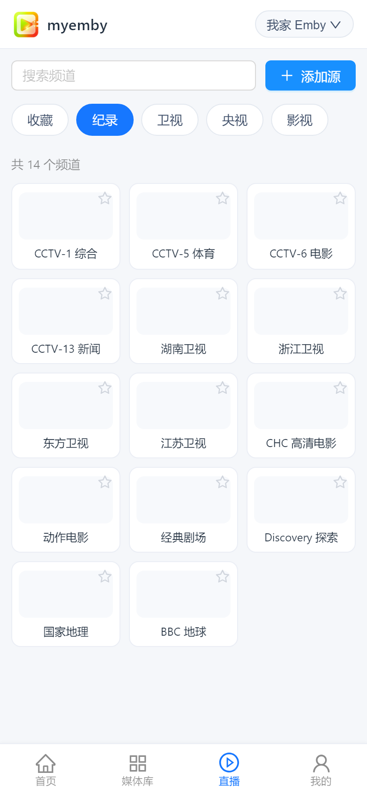
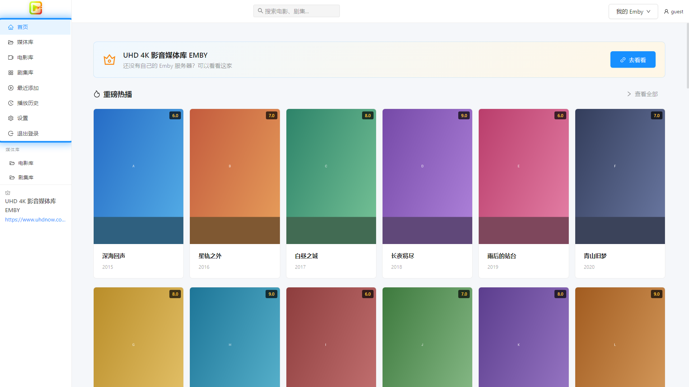
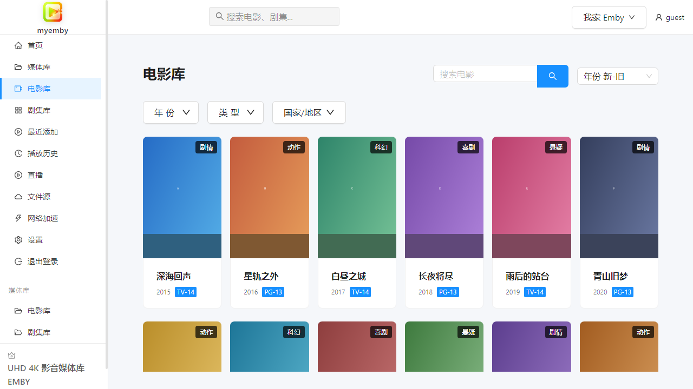

# myemby（我的EMBY）

> 一个轻量、干净的 Emby 客户端 —— **默认浅色主题**，**五个平台同一套体验**。

<p>
  
  
  
  
  
  
</p>

myemby 把网页版的 [Emby](https://emby.media/) 变成一个**独立、顺手、看得清**的客户端：
不用再开浏览器、不用再忍受深色界面。一套代码同时出 **Windows / Linux / Android 手机 /
Android TV / 网页端**，五端界面一致、功能一致、改一处全端生效。

> 🎬 **推荐 Emby 服务**：[UHD 4K 影音媒体库 EMBY](https://www.uhdnow.com/signup?invite=AN913K)
> —— 还没有自己的 Emby 服务器？可以看看这家。

---

## 📸 界面预览

### 桌面端

#### 首页 —— 重磅热播 / 分类聚合


#### 电影库 —— 搜索、年份 / 类型 / 国家筛选与排序


#### 剧集库


#### 播放页 —— 影片详情、剧集选择、猜你喜欢


#### 直播（IPTV）—— 频道分组、搜索与收藏



#### 网络加速 —— Xray / sing-box 双核心



#### 最近添加


#### 设置 —— 服务器管理、媒体源、电视模式开关


### 手机端

底部导航 + 三列海报网格，一屏能看到更多内容。

<p>
  
  
  
</p>

### 电视端

电视端独立成包、锁定横屏，界面元素放大并带高亮焦点环，全程方向键 + 回车操作。

<p>
  
  
</p>

---

## ✨ 功能特点

- **五端同源**：Windows / Linux / Android 手机 / Android TV / 网页端，一套代码。
- **默认浅色主题**：整体浅白配色，长时间看不刺眼；仅视频画面区域保持黑色。
- **直接播放 Emby 内容**：支持 HLS 流媒体，可切换码流与字幕。
- **媒体库浏览**：电影库、剧集库、最近添加、播放历史一应俱全。
- **搜索**：顶部搜索框直接搜影片、剧集、单集。
- **筛选与排序**：按年份、类型、国家/地区筛选，按添加时间 / 名称 / 年份 / 评分排序。
- **剧集连播**：点剧集自动从第一季第一集开始，播放页可切换季与集。
- **多服务器**：保存多个 Emby 服务器随时切换，凭据本地加密存储。
- **手机端原生布局**：底部导航栏（首页 / 媒体库 / 直播 / 我的），海报三列网格，筛选器不再被截断。
- **手机播放手势**：单击暂停、双击左右快进快退 10 秒、横向滑动拖动进度、
  左侧上下滑调亮度、右侧上下滑调音量。
- **电视端遥控器操作**：方向键焦点导航 + 回车确认 + 返回键回退，界面元素自动放大。
- **直播（IPTV）**：导入 M3U / TXT 频道表，自动分组、搜索、收藏，支持 HLS 播放。
- **弹幕**：播放时按片名自动匹配弹弹Play 弹幕并叠加显示，可调透明度、字号、显示区域。
- **文件源（WebDAV）**：连接 Alist / 群晖 / 飞牛等 WebDAV，浏览目录并直接播放里面的视频。
- **网页端即开即用**：不用安装，浏览器打开就能连自己的 Emby。
- **内置网络加速**：自带 Xray / sing-box 双核心，可直接导入订阅链接或粘贴节点分享链接，
  覆盖 vmess / vless / trojan / shadowsocks / hysteria2 / tuic 等协议；
  **只加速 myemby 自身**，不影响系统里其他软件，也不会干扰你自己的内网 Emby 服务器。
  桌面与电视端支持**开机自动加速**，电视上不用每次开机手动开。

---

## ⬇️ 下载安装

全部产物都在 [**Releases**](https://github.com/xikkcn/myemby/releases) 页面。

### Windows

| 文件 | 说明 |
| --- | --- |
| `myemby-Setup-1.0.2.exe` | **安装版（推荐）**。可自选安装位置，自动创建快捷方式，带卸载程序。 |
| `myemby-Portable-1.0.2.exe` | **免安装版**。双击直接运行，不写注册表，可放 U 盘。 |

要求 Windows 10 / 11 / Windows Server 2016 及以上（64 位）。

### Linux

| 文件 | 说明 |
| --- | --- |
| `myemby-1.0.2-linux-x64.tar.gz` | 绿色包，解压后执行目录里的 `myemby` 即可，绝大多数发行版通用。 |

> AppImage / deb 需要 Linux 环境构建（Windows 无法交叉编译）。仓库自带 GitHub Actions
> 工作流，在 Actions 里手动运行一次即可产出这两种格式。

### Android 手机 / 平板

手机端是**一份通用包**，同时含 64 位与 32 位核心，不用挑 CPU 架构。

| 文件 | 说明 |
| --- | --- |
| `myemby-1.0.2-phone.apk` | **手机 / 平板推荐**。Android 5.1（API 22）及以上。 |
| `myemby-1.0.2-phone-legacy21.apk` | 老机型兼容版，最低 Android 5.0（API 21），新设备不需要。 |

### Android TV / 电视盒子

电视端**单独出包**（不会和手机版互相覆盖）：强制横屏、应用名显示为 `myemby TV`、
针对遥控器做了方向键焦点导航。

电视端按 **64 位 / 32 位** 分别出包 —— 老盒子多为 32 位 ARM，装 64 位包会直接失败；
新盒子装 32 位包则浪费性能。**先确认自己盒子的架构再下载**。

| 文件 | 适用 | Android 版本 |
| --- | --- | --- |
| `myemby-1.0.2-tv-arm64.apk` | **64 位电视 / 盒子（推荐）** | 5.1（API 22）+ |
| `myemby-1.0.2-tv-arm32.apk` | **32 位电视 / 老盒子** | 5.1（API 22）+ |
| `myemby-1.0.2-tv-arm64-legacy21.apk` | 64 位 + 老系统 | 5.0（API 21） |
| `myemby-1.0.2-tv-arm32-legacy21.apk` | 32 位 + 老系统 | 5.0（API 21） |

> **怎么判断自己是 64 位还是 32 位**：装一个「AIDA64」或「DevCheck」之类的应用看一下 CPU 架构；
> 或者直接先试 `arm64`，装不上（提示「应用未安装」或解析失败）就换 `arm32`。
> 2018 年以前的老盒子基本都是 32 位。
>
> TV 端**与手机端用不同的包名**，同一个设备上可以同时装，互不覆盖。
>
> TV 端支持**手机扫码配置加速节点**：电视上显示二维码，手机扫码打开一个局域网网页，
> 粘贴节点或订阅后点提交，电视立刻导入并生效 —— 全程不用遥控器打字。

### 网页端（免安装，浏览器直接用）

在线地址：**https://xikkcn.github.io/myemby/**

打开即用，连你自己的 Emby 服务器即可。缺点是不支持直连一些需要本地解码的特殊编码，
高码率片源建议用桌面端或电视端。

---

## 🚀 使用说明

### 1. 添加服务器

首次打开会停在 **设置 → 服务器管理**，点 **添加服务器**：

| 字段 | 说明 |
| --- | --- |
| 服务器名称 | 随便起，仅用于区分，例如「家里的 Emby」 |
| 服务器地址 | 只填主机名或 IP，**不要带 `http://`**，例如 `192.168.1.10` |
| 协议 | 局域网一般 `http`；用域名 + HTTPS 证书时选 `https` |
| 端口 | Emby 默认 `8096`，HTTPS 默认 `8920`；留空用协议默认端口 |
| 用户名 / 密码 | 你的 Emby 账号，填了下次自动登录 |

点保存后回到首页，右上角 **登录**（填过账号密码会自动登录）。

### 2. 浏览与播放

- 左侧栏切换 **首页 / 媒体库 / 电影库 / 剧集库 / 最近添加 / 播放历史 / 设置**。
- 顶部搜索框输入 2 个字以上会实时出结果，点结果直接播放。
- 点海报开始播放；点剧集从第一季第一集开始。
- 播放页下方是 **影片详情**、**猜你喜欢**；剧集可在详情区切换季与集。
- 播放器右下角可切换码流（清晰度）与字幕。

### 3. 手机端怎么用

手机上界面会自动切成移动布局：**底部导航**（首页 / 媒体库 / 直播 / 我的）+ **三列海报网格**。

播放时支持手势：

| 手势 | 作用 |
| --- | --- |
| **单击画面** | 暂停 / 继续 |
| **双击左侧** | 后退 10 秒 |
| **双击右侧** | 前进 10 秒 |
| **左右滑动** | 拖动播放进度 |
| **左侧上下滑动** | 调亮度 |
| **右侧上下滑动** | 调音量 |

播放器自带控件（进度条、按钮）上的触摸不会触发手势，可以放心操作。

### 4. 直播（IPTV）

进入 **直播** 页，点 **添加源**：

- **频道表地址**：填 M3U 或 TXT 频道表的 URL（本地文件也可以直接粘贴内容导入）。
- **节目单地址**（可选）：XMLTV 格式的 EPG 地址。

导入后会自动按 `group-title` 分组，可搜索、可收藏。电视端用遥控器即可切换频道。

### 5. 文件源（WebDAV）

进入 **文件源** 页，点 **添加源**，填 WebDAV 地址、用户名、密码。适用于：

- **Alist**：`http://你的地址:5244/dav`
- **群晖**：`http://你的地址:5005`（WebDAV Server 套件）
- **飞牛 fnOS**：按其说明开启 WebDAV 后填入口地址

连上后可浏览目录，点视频文件直接播放，支持断点续播。

### 6. 弹幕

到 **设置 → 媒体源 → 弹幕** 打开开关即可。播放时按影片名自动匹配弹弹Play 弹幕。

可调**透明度**、**字号**、**显示区域**；接口地址与 AppId / AppSecret 也可以改成兼容服务。
如果匹配不准，多半是片名带发布组后缀，手动在设置里改接口或用带 AppId 的服务即可。

### 7. 网络加速怎么用

到 **网络加速** 页：

1. **添加订阅**：粘贴机场订阅链接，或**手动添加**粘贴节点分享链接
   （支持 `vmess://` `vless://` `trojan://` `ss://` `hysteria2://` `tuic://` 等）。
2. 在节点列表里选一个，可点 **全部测速** 看延迟。
3. 点右上角开关启用。此后 myemby 自身的请求会走这个节点，**系统里其他软件不受影响**，
   你自己的内网 Emby 地址也会自动直连、不会被绕进代理。
4. 打开 **开机自动加速**，下次启动会自动沿用上次的节点（电视端尤其推荐）。

> 电视端还支持**手机扫码配置**：点「用手机扫码配置」显示二维码，手机扫码打开局域网网页，
> 粘贴节点或订阅提交即可。

### 8. 电视端怎么用遥控器

电视端打开后会自动进入**电视模式**，界面元素放大、出现蓝色焦点框：

| 按键 | 作用 |
| --- | --- |
| **方向键 ↑↓←→** | 在按钮、海报、菜单之间移动焦点 |
| **确定 / 回车** | 打开当前选中的项目 |
| **返回键** | 回到上一级页面 |
| **菜单键** | 部分设备可呼出播放器控制条 |

如果自动识别没生效（个别电视盒子无触摸屏判断不准），到 **设置 → 应用设置 → 电视模式**
手动打开开关即可。也可以在网址后加 `?tv=1` 强制开启。

### 9. 网页端在线使用

访问 https://xikkcn.github.io/myemby/ ，添加服务器即可。
因为是浏览器直连你的 Emby，**Emby 服务器必须允许跨域**（Emby 默认已允许）；
若你的服务器在局域网且没有公网地址，外网访问需要自己做好端口映射或内网穿透。

### 10. 数据存在哪

服务器地址、账号与登录令牌保存在本机应用数据目录（`localStorage`），服务器配置做了 AES 加密。
**卸载或清空应用数据即彻底清除**，不会上传到任何地方。

---

## ❓ 常见问题

**Q：打开是白屏 / 一直转圈？**
先确认没有被杀毒软件拦截。若装过旧版本，清空应用数据后重开一次。

**Q：连不上服务器？**

- 地址栏只写主机名/IP，不要带 `http://`，协议由下拉框决定。
- 端口确认：HTTP 默认 `8096`，HTTPS 默认 `8920`。
- 自签名证书的 HTTPS 服务器已做忽略证书校验处理，正常可连。
- 检查设备与 Emby 服务器是否同网、防火墙是否放行。

**Q：能登录、能看列表，但点播放黑屏？**
多数是服务端转码未开启，或该视频编码当前客户端不支持。先在 Emby 网页端试播同一个视频，
若网页端也要转码，请检查服务端转码设置（硬件转码 / FFmpeg 路径）。

**Q：电视上方向键没反应？**
到设置里确认「电视模式」已打开；或改用遥控器的「鼠标模式」确认应用是否获得焦点。

**Q：电视该装哪个 APK？**
先试 `tv-arm64`。如果提示「应用未安装」或解析失败，说明盒子是 32 位，换 `tv-arm32`。
系统是 Android 5.0 的老盒子，选带 `legacy21` 的那两个。详见上面的下载表格。

**Q：电视端和手机端能装在同一台设备上吗？**
可以。两者使用不同的包名（`com.myemby.app` 与 `com.myemby.app.tv`），互不覆盖。

**Q：网络加速开了但没效果？**
- 先在节点列表点「全部测速」，确认节点本身通。
- 检查是不是选了协议不匹配的核心：`hysteria2` / `tuic` 只有 sing-box 支持，
  核心选择留在「自动」即可。
- 你自己的 Emby 服务器如果是内网地址（`192.168.x` / `10.x`），会**自动直连不走代理**，
  这是预期行为，不受加速影响。

**Q：弹幕搜不到 / 匹配不准？**
弹弹Play 的部分接口需要 AppId，或你的网络需要走代理才能访问弹幕接口。
可以到 **设置 → 媒体源 → 弹幕** 填 AppId / AppSecret，或把接口地址换成兼容服务。

**Q：直播频道加载不出来？**
先在浏览器里直接打开那个频道地址，确认源本身可用。IPTV 源失效很常见，
换一个频道表或联系源提供方即可。

**Q：为什么视频区域是黑的？**
播放器画面用黑底是刻意的（与主流视频网站一致，避免亮边框影响观感），界面其余部分都是浅色。

---

## 🛠️ 从源码构建

需要 Node.js 18+（推荐 20/22）。安卓端另需 JDK 17 与 Android SDK。

```bash
git clone https://github.com/xikkcn/myemby.git
cd myemby

npm install

# 先把代理核心拉下来（约 150MB，打包与安卓都需要，产物不入库）
node vendor/dl.mjs       # 国内会优先走加速镜像，想直连加 --direct

# 开发模式
npm run dev              # 浏览器调试界面
npm run electron:dev     # 桌面端调试（需先启动 npm run dev）

# 桌面端打包（产物在 dist_electron/）
npm run electron:build:win
npm run electron:build:linux

# 网页端
npm run build            # 产物在 dist/renderer/

# 安卓端（需先配好 Android SDK）
node vendor/prepare.mjs  # 把核心摆到 jniLibs 与打包目录
npm run cap:sync
npm run cap:open         # 用 Android Studio 打包，或用 gradle 命令行
```

### 国内网络

仓库自带 `.npmrc`，已把 Electron 与 electron-builder 的下载源指向国内镜像。
如果打包报 `Bad Gateway`，说明 electron-builder 没读到 `.npmrc`，请显式导出：

```bash
export ELECTRON_MIRROR="https://npmmirror.com/mirrors/electron/"
export ELECTRON_BUILDER_BINARIES_MIRROR="https://npmmirror.com/mirrors/electron-builder-binaries/"
```

### 目录结构

```
main.js                 Electron 主进程（Windows / Linux）
preload.js              预加载脚本
index.html              页面入口
vite.config.ts          Vite 配置（输出到 dist/renderer）
capacitor.config.ts     安卓端配置
electron-builder 配置    见 package.json 的 build 字段
buildResources/
  icon.ico              Windows 图标（7 种尺寸）
  icons/                Linux 图标集
  android/              安卓图标（自适应图标）
main/                   Electron 主进程模块
  proxyManager.js       代理核心进程管理（启动/停止/端口探测/日志）
src/
  main.tsx              React 入口（HashRouter + 电视模式初始化）
  App.tsx               路由与主题配置
  config/promo.ts       应用名 / 推广位等全局常量
  platform/             平台识别、电视端方向键空间导航、代理后端抽象
  components/           布局、搜索栏、底部导航、播放手势、推广位等
  pages/                首页、电影库、剧集库、播放页、直播、文件源、设置、网络加速
  proxy/                节点模型、分享链接与订阅解析、Xray / sing-box 配置生成
  danmaku/              弹幕接口、渲染层与配置
  stores/               Zustand 状态管理（服务器 / 登录 / 媒体库 / 直播 / 文件源 / 代理）
  styles/               全局样式（含 tv.scss 电视模式、mobile.scss 手机适配）
docs/images/            README 用界面截图
android/                Capacitor 安卓工程（手机 / TV 双风味，含 Kotlin 代理插件）
vendor/                 构建期下载代理核心的脚本（二进制不入库）
```

---

## 📦 技术栈

Electron 25 · Capacitor · React 18 · TypeScript 5 · Vite 4 · Ant Design 5 ·
Zustand · Axios · HLS.js · Video.js · Sass · Xray-core · sing-box

---

## ⚠️ 免责声明

本项目仅供学习与研究使用，请勿用于商业用途。使用本软件产生的任何后果由使用者自行承担。
本项目不提供任何媒体内容，也不对第三方 Emby 服务器及其内容的合法性负责。

---

## 📝 许可证

[MIT](LICENSE) © 2025 xikkcn

本项目包含来自
[CodeCrafter-bit/emby-player](https://github.com/CodeCrafter-bit/emby-player) 的代码，
其原始版权声明已依 MIT 许可证保留于 [LICENSE](LICENSE) 文件中。

---

> 🎬 **UHD 4K 影音媒体库 EMBY** —— [https://www.uhdnow.com/signup?invite=AN913K](https://www.uhdnow.com/signup?invite=AN913K)
